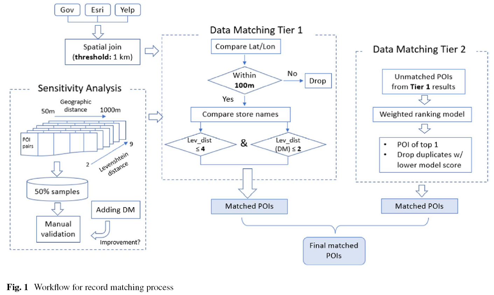

# A Hierarchical Framework for Matching Food Outlets across Multi-sourced Geospatial Datasets

This repository hosts codes snippets of the hierarchical framework that matches food outlets from multiple datasets.

- Paper reference:
    - Cao, Y., Yang, J.-A., Nara, A., & Jankowska, M. M. (2024). *Designing and Evaluating a Hierarchical Framework for Matching Food Outlets across Multi-sourced Geospatial Datasets: a Case Study of San Diego County.* Journal of Urban Health. https://doi.org/10.1007/s11524-023-00817-9

- For questions, please contact Yanjia Cao (yanjiac@hku.hk)

## Overview of Matching Workflow

## File Structures in This Repository
